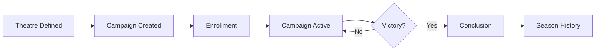
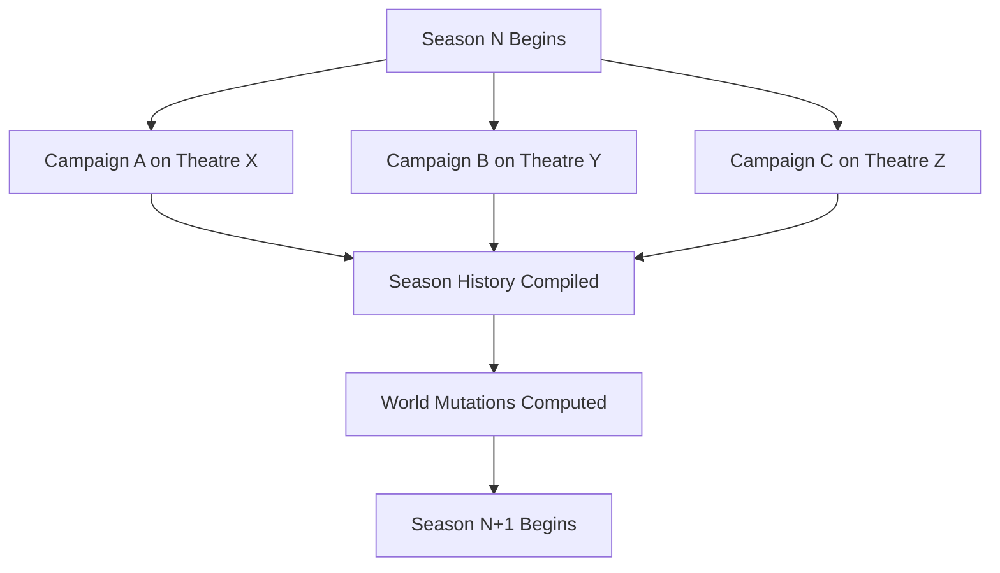

# The Long War - Campaign Rules

## Overview

The Long War is a season-based grand strategy layer for Trench Crusade. Players enroll their warbands in campaigns that take place on theatres of operations (groups of hex regions on the world map). Battles are fought on the tabletop (or resolved on-chain), and their outcomes permanently affect the world state.

- **Campaigns**: up to 12 players, on a single Theatre
- **Theatres**: composed of 1+ hex regions with primary and secondary objectives
- **Seasons**: a series of campaigns whose combined results reshape the world

All campaign state, warband progression, resource flows, and territorial control are recorded on-chain. The blockchain is the single source of truth.

## Campaign Lifecycle



1. **Theatre Selection** - An admin defines a theatre from one or more world regions, sets primary objective (elimination) and secondary objectives (kill leader, loot resource).

2. **Campaign Creation** - A player creates a campaign on a theatre. Configurable: max players (2-12), mode (Free-for-All or Teams), VP threshold for victory.

3. **Enrollment** - Players enroll existing warbands. Warbands are locked to the campaign for its duration. In Teams mode, players are assigned to a team.

4. **Turns** - The campaign progresses through turns. Each turn has four phases executed in order.

5. **Conclusion** - Campaign ends when victory conditions are met (elimination or VP threshold). Results are compiled.

6. **Season Resolution** - At the end of a season, all campaign results across theatres are compiled and the chain computes world mutations.

## Turn Structure

Each campaign turn proceeds through four sequential phases:

### Phase 1: Battle

Players whose warbands occupy the same tile or adjacent tiles may engage in battle.

- Battles are played on the tabletop using Trench Crusade rules
- The result (winner, loser, draw, rout) is reported on-chain by both players
- A root oracle validates and computes the canonical result
- Victory Points are awarded based on the outcome:
  - **Game Won**: +3 VP (configurable)
  - **Game Lost**: +1 VP
  - **Draw**: +2 VP each
  - **Kill Leader**: +2 VP (secondary objective)
  - **Loot Resource**: +1 VP (secondary objective)

### Phase 2: Post-Battle

After each battle, both warbands go through a post-battle sequence:

1. **Trauma** - Injured models roll on the trauma table (from `campaign-rules`). Results range from full recovery to permanent death.

2. **XP Distribution** - Surviving models gain XP based on actions performed during battle.

3. **Promotions** - Models that reach XP thresholds may be promoted to Elite status, gaining access to advanced equipment and skills.

4. **Exploration** - The winning warband explores the battlefield. Dice rolls on the exploration table yield loot, discoveries, or special events.

5. **Quartermaster** - The warband leader spends ducats to:
   - Recruit replacement models
   - Purchase equipment from the faction armoury
   - Heal injured models (reduce recovery time)
   - Acquire rare items found during exploration

### Phase 3: Movement

After post-battle resolution, warbands move on the theatre hex map.

- Each warband may move **1 to 3 hexes** per turn
- Movement cost depends on terrain:
  - Plains, Steppe: 1 movement point per hex
  - Forest, Mediterranean, Semi-arid: 1 movement point
  - Mountain, Marsh: 2 movement points
  - Iron Wall: impassable (except for Iron Sultanate warbands)
- After moving, the warband **locks** its position for the next turn's battle phase
- A warband that does not move still locks in place

### Phase 4: Supply

The logistics system ticks once per turn for the theatre's regions.

- Resources (flesh, iron, powder) flow between regions via the routing system
- Warbands on tiles connected to a supply source receive full resupply:
  - Ammunition replenished
  - Injured models begin recovery
  - Ducats income from controlled trade posts
- Warbands **cut off** from supply suffer attrition:
  - Cannot recruit new models
  - Cannot purchase equipment
  - Models do not recover from injuries
  - -1 morale penalty in next battle

## Victory Conditions

A campaign ends when one of these conditions is met:

- **Elimination** (primary objective): All opposing warbands are eliminated or withdraw. Last team/player standing wins.
- **VP Threshold**: A player or team reaches the configured VP total. The campaign concludes at end of that turn.
- **Turn Limit** (optional): If configured, the campaign ends after N turns. Highest VP wins.

## Secondary Objectives

Theatres define secondary objectives that award bonus VP:

| Objective | Trigger | Reward |
|-----------|---------|--------|
| Kill Leader | Slay the enemy warband's leader model in battle | +2 VP |
| Loot Resource | Control a tile with the specified resource for 2 consecutive turns | +1 VP per turn held |

## Economy and Resources

Four resources drive the war economy:

| Resource | Source | Role |
|----------|--------|------|
| **Flesh** | Farms (northern regions) | Feeds armies, recruits models |
| **Iron** | Mines (mountain regions, Iron Wall) | Arms and armours |
| **Powder** | Powder mills (eastern/Islamic regions) | Ammunition, the critical bottleneck |
| **Ducats** | Trade posts, markets (local only) | Currency for quartermaster actions |

Key design principles:
- All physical resources (flesh, iron, powder) are transported between regions via caravans
- Ducats are **local only** - they do not travel (currency, not physical goods)
- Global production is intentionally below global demand (~0.7-1.0x ratio)
- This forces trade and makes supply line control strategically vital
- Regions are specialized by geography and lore (powder from the Orient, iron from central Europe, flesh from the northern breadbasket)

## Season System

A season represents a period of the Great War (thematically: months or years of conflict).

### Season Flow



### World Mutations

At season end, the chain processes all campaign results and applies permanent changes to the world:

- **Territory Control**: Regions change hands based on campaign outcomes. A faction that won campaigns in a theatre claims control of contested regions.

- **Building Destruction/Construction**: Battles damage buildings in contested tiles. Winners may construct new buildings in captured territory.

- **Resource Route Disruption**: Supply lines through heavily contested regions are damaged. Transit times increase, capacity decreases.

- **New Objectives Emerge**: Based on the new territorial situation, new theatres and objectives are automatically generated for the next season.

- **Warband Legacy**: Surviving warbands carry their roster, equipment, glory, and scars into the next season. Eliminated warbands are permanently dead.

## Implementation Status

| Feature | Chain Pallet | Status |
|---------|-------------|--------|
| Campaign CRUD | `pallet-campaign` | Done |
| Warband enrollment | `pallet-warband` + `pallet-campaign` | Done |
| Turn advancement | `campaign.advance_turn` | Done (root-only) |
| VP scoring | `campaign.award_vp` | Done (not auto-triggered) |
| Battle challenge/report | `pallet-battle` | Done |
| Post-battle trauma/XP | `pallet-roster` | Done (root-only calls) |
| Exploration/loot | `pallet-exploration` | Done |
| Territory control | `pallet-territory` | Done |
| Logistics system | `pallet-logistics` + `pallet-production` + `pallet-demand` | Done |
| Theatre definition | `pallet-theatre` | Done |
| Warband hex movement | -- | **To build** |
| Movement terrain costs | -- | **To build** |
| Supply connection check | `pallet-logistics` (partial) | To wire |
| Auto VP from battle result | `pallet-battle` -> `pallet-campaign` | **To wire** |
| Post-battle phase machine | `PostBattlePhase` enum exists | **To build** |
| Season system | -- | **To build** |
| History compilation | -- | **To build** |
| World mutation engine | -- | **To build** |
| DApp campaign flow | Pages exist, chain calls stubbed | **To wire** |

## What Needs to Be Built

### 1. Warband Position (new storage in `pallet-campaign`)

```rust
#[pallet::storage]
pub type WarbandPositions<T: Config> = StorageDoubleMap<
    _, Blake2_128Concat, CampaignId,
    Blake2_128Concat, WarbandId,
    TileCoord, OptionQuery,
>;
```

Extrinsic: `move_warband(campaign_id, warband_id, path: BoundedVec<TileCoord, MaxMoveLen>)`

Validates:
- Caller owns the warband
- Campaign is in movement phase
- Path is contiguous (hex adjacency)
- Total movement cost <= warband's movement allowance
- Destination tile is within the theatre

### 2. Post-Battle State Machine (extend `pallet-battle`)

Per-battle phase progression tracked on-chain:

```
Trauma -> XP -> Promote -> Explore -> Quartermaster -> Done
```

Each phase has a dedicated extrinsic that:
- Validates the battle is in the correct phase
- Applies the phase effects (trauma rolls, XP grants, etc.)
- Advances to the next phase
- Emits an event

### 3. Season Pallet (new)

```rust
#[pallet::storage]
pub type CurrentSeason<T: Config> = StorageValue<_, SeasonId, ValueQuery>;

#[pallet::storage]
pub type SeasonHistory<T: Config> = StorageMap<
    _, Blake2_128Concat, SeasonId,
    BoundedVec<CampaignResult, MaxCampaignsPerSeason>, ValueQuery,
>;
```

Extrinsic: `end_season(origin)` (root-only)
- Compiles all concluded campaigns from the current season
- Computes world mutations (territory, buildings, routes)
- Applies mutations to `pallet-territory` and `pallet-logistics`
- Increments season counter
- Emits `SeasonEnded` event with mutation summary

### 4. Auto-VP Glue (modify `pallet-battle`)

In `compute_result`, after determining the winner:
- Call `T::CampaignScoring::award_vp(campaign_id, winner_warband, VpGameWon)`
- Call `T::CampaignScoring::award_vp(campaign_id, loser_warband, VpGameLost)`
- Check secondary objectives (leader killed, resource looted) and award bonus VP
- Call `T::CampaignScoring::check_victory(campaign_id)` to see if VP threshold reached
