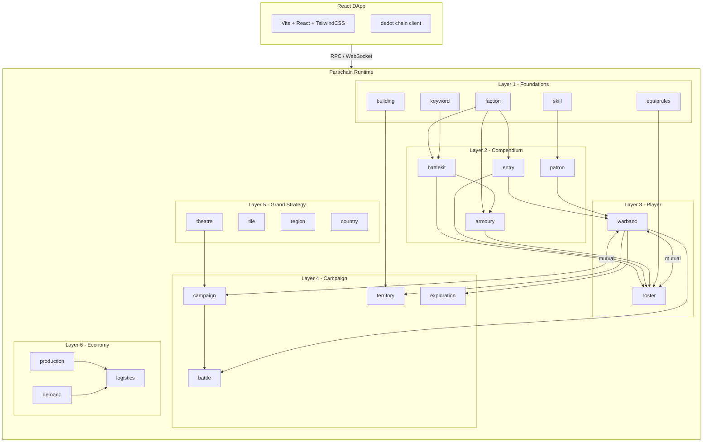

# Trenchain

On-chain campaign game for [Trench Crusade](https://www.trenchcrusade.com/) built as a Polkadot SDK parachain.

Trenchain brings the Trench Crusade tabletop wargame into a persistent, season-based grand strategy layer where campaign results, warband progression, resource logistics, and territorial control all live on-chain.

## Architecture



### Dependency layers

| Layer | Pallets | Role |
|-------|---------|------|
| 1 - Foundations | keyword, skill, faction, equiprules, building | Base definitions, no dependencies |
| 2 - Compendium | battlekit, entry, patron, armoury | Game content (units, items, patrons) |
| 3 - Player | warband, roster | Player-owned state (mutual cycle) |
| 4 - Campaign | campaign, battle, territory, exploration | Active gameplay (mutual cycle with warband) |
| 5 - Grand Strategy | tile, region, country, theatre | World map and theatre definitions |
| 6 - Economy | production, demand, logistics | Resource flows between regions |
| Rules | campaign-rules, exploration-rules, terrain-rules | Config data stores (isolated) |

## Monorepo Layout

```
trenchain/
  start.sh               # Full-stack launcher (build, seed, serve)
  parachain-template/    # Polkadot SDK parachain
    runtime/             #   Runtime configuration
    pallets/             #   FRAME pallets (game logic)
    primitives/tc/       #   Shared types and traits
  dapp/                  # Frontend application
    src/pages/           #   React pages
    src/hooks/           #   Chain data hooks
    src/chain/           #   Transaction helpers
    scripts/seed/        #   On-chain data seeding
    src/data/rules/      #   Static game data (hex map, regions, buildings)
```

## Prerequisites

- **Rust** (stable + nightly for WASM): `rustup`
- **Node.js** 20+
- **polkadot-omni-node**: generic Polkadot node binary
- **chain-spec-builder**: chain specification generator

Install Polkadot tooling:

```bash
cargo install polkadot-omni-node chain-spec-builder
```

## Quick Start

```bash
./start.sh
```

This will:
1. Build the parachain runtime (release)
2. Generate the chain spec from the compiled WASM
3. Start a dev node (3-second blocks)
4. Generate dedot TypeScript types
5. Seed all on-chain data (compendium, geography, logistics, theatre, rules)
6. Start the dApp dev server at `http://localhost:5173`

Options:
- `--skip-build` : skip Rust compilation
- `--skip-types` : skip dedot type generation

## Game Rules

See [GAMEPLAY.md](GAMEPLAY.md) for the full Long War campaign rules, turn structure, and season system.

## Pallets

| Pallet | Purpose |
|--------|---------|
| `pallet-campaign` | Campaign lifecycle, enrollment, turns, VP scoring |
| `pallet-battle` | Challenge, accept, dual reports, compute result |
| `pallet-warband` | Warband creation, progression, locking |
| `pallet-roster` | Model recruitment, equipment, trauma, XP, promotion |
| `pallet-theatre` | Theatre definition (regions + objectives) |
| `pallet-territory` | Per-campaign territory control and buildings |
| `pallet-logistics` | Resource routing between regions (packets, BFS) |
| `pallet-production` | Terrain yields, building recipes, extractors |
| `pallet-demand` | Regional resource demand registration |
| `pallet-exploration` | Post-battle loot, discovery, skill checks |
| `pallet-tile` | Hex map storage, terrain registry |
| `pallet-region` | Region definitions and tile assignments |
| `pallet-compendium` | Factions, entries, battlekit, armoury, patrons |
| `pallet-campaign-rules` | Trauma tables, VP thresholds, phase config |

## Development

The parachain uses the standard Polkadot SDK development flow:

```bash
# Build runtime only
cargo build --release -p parachain-template-runtime

# Run tests
cargo test --workspace
```

The dApp is a standard Vite project:

```bash
cd dapp
npm install
npm run dev
```

## License

This project is licensed under the [GNU General Public License v3.0](LICENSE).
